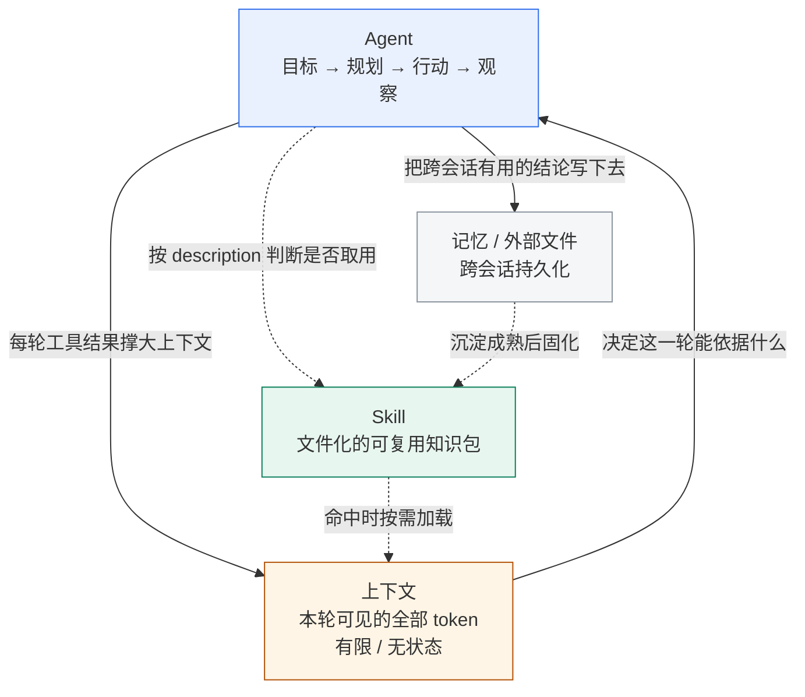

# 三个概念的关系：Agent · 上下文 · Skill

> 本文说明 `Agent`、`大模型的上下文`、`Skill` 三者如何互相作用。
> 网页版见 [concept-relationship.html](concept-relationship.html)（可直接用浏览器打开）。
> 生成日期：2026-09-08 ｜ 生成方式：项目级 Skill `concept-study-kit` + 人工核查修改

---

## 1. 一句话总览

**上下文是 Agent 每一轮"能看到的世界"，Skill 是存放在这个世界之外的、可按需取用的经验包。**

三者回答的是三个不同层次的问题：

| 概念 | 回答的问题 | 时间尺度 | 存在位置 |
| --- | --- | --- | --- |
| **Agent** | 谁在做事、怎么做决策 | 一次任务的执行过程 | 运行时的循环逻辑 |
| **上下文** | 它当下能依据什么做决策 | 单轮 / 单次会话 | 每次请求发送给模型的 token |
| **Skill** | 它的本领从哪来、怎么复用 | 跨会话 / 跨任务 | 文件系统（可用 Git 管理） |

---

## 2. 关系图



**读图要点**：实线是每轮都在发生的"热路径"，虚线是按需发生的"冷路径"。上下文位于中心，因为另外两者都要通过它才能起作用。

---

## 3. 重点一：上下文如何影响 Agent 的工作

### 3.1 上下文是 Agent 的唯一信息入口

Agent 的每一步决策——规划什么、调用哪个工具、是否结束——都只能基于**当前上下文里的内容**。上下文里没有的信息，对这一轮的 Agent 而言等于不存在。

### 3.2 Agent 的循环会自我膨胀

这是 Agent 特有的、也是最容易被忽视的问题：

```
第 1 轮：系统提示 + 用户目标
第 2 轮：+ 第 1 轮的工具调用与返回结果
第 3 轮：+ 第 2 轮的工具调用与返回结果
   …
第 N 轮：上下文被历史工具结果不断撑大
```

**Workflow 不会这样**（每步是独立调用），而 **Agent 会**——它必须带着完整历史才能做下一步判断。所以"能不能跑完一个长任务"，本质上是个上下文问题。

### 3.3 撑大的后果不只是"装不下"

| 后果 | 表现 | 对应机制 |
| --- | --- | --- |
| 硬失败 | 超出窗口上限，请求直接报错 | 窗口有 token 上限 |
| 质量下降 | 模型开始遗忘早期的约束（如"禁止改动 A 目录"） | 注意力预算被稀释 |
| 位置偏差 | 写在说明中间的规则最容易被忽略 | U 形曲线（Lost in the Middle） |
| 成本上升 | 每轮都要重发全部历史 | 输入 token 计费 |

### 3.4 结论

**上下文管理不是 Agent 的"优化项"，而是"能不能跑完、跑得稳不稳"的决定项。** 具体手段（即时加载、压缩/上下文编辑、提示缓存、记忆工具、工具搜索）见 [llm-context.html](llm-context.html) §4.3。

> 我的判断：评价一个 Agent 系统的工程水平，看它的上下文策略比看它的提示词有用得多。提示词决定它起步好不好，上下文策略决定它能走多远。

---

## 4. 重点二：Skill 如何沉淀可复用任务知识

### 4.1 从"常驻上下文"到"常驻磁盘"

| 做法 | 知识放在哪 | 代价 |
| --- | --- | --- |
| 写进系统提示 | 每次请求的上下文里 | 无论用不用都占 token，且总量受限 |
| **写成 Skill** | 文件系统里 | 不用时不占；用时才花 token 换入 |

Skill 通过**三层渐进式披露**实现这一点：元数据常驻（约 100 tokens/个）→ 命中后加载正文 → 资源文件按需加载。因此一个 Skill 能打包的知识量**几乎不受上下文窗口限制**。

### 4.2 沉淀是怎么发生的

```
第一次做某类任务  →  人反复口述要求，格式每次都漂移
        ↓  把要求写下来
写成 SKILL.md     →  流程、输出结构、自检清单被固化
        ↓  Git 管理
可版本化评审      →  越用越准，可团队共享
        ↓
下一个 Agent 直接具备这项本领，无需重新教学
```

### 4.3 为什么"文件"这个形态是关键

因为 Skill 就是普通目录，所以它天然获得了一整套软件工程的协作能力：**版本管理、Code Review、回滚、分发**。这让"经验"第一次从聊天记录里的一次性文本，变成了可积累的工程资产。

---

## 5. 三者的闭环（我的判断）

把三件事连起来看，是一个正反馈循环：

1. **Skill 让 Agent 更会做事**（按需获得专家流程）；
2. **Agent 做事产生大量上下文**（工具结果、试错过程）；
3. **上下文管理把其中值得留下的部分挑出来**（压缩掉噪声，把结论写入记忆文件）；
4. **沉淀下来的结论成熟后固化为 Skill**；
5. 下一轮 Agent 从更高的起点出发。

由此得出三个个人判断：

- **判断一：上下文管理与 Skill 是同一个问题的两个时间尺度。**
  问题的本质都是"如何在有限的注意力预算里放入最有用的 token"。区别只在于：上下文管理解决**本轮/本次会话**的取舍，Skill 解决**跨会话/跨任务**的复用。

- **判断二：Skill 的流行是上下文受限的必然结果。**
  正因为上下文是稀缺资源，才需要把知识外置到文件系统、按需加载。如果上下文无限且免费，Skill 这种设计的必要性会大打折扣。

- **判断三：三者中，Agent 是执行者，上下文是它当下的意识，Skill 是它的长期训练。**
  只有意识没有训练，它会反复犯低级错误；只有训练没有意识，它拿不到当前任务的真实信息。两者都要通过上下文这个唯一的入口起作用。

---

## 6. 一个贯穿三者的例子

以本仓库 `concept-study-kit` 生成这份资料的过程为例：

| 阶段 | 对应的概念 | 实际发生的事 |
| --- | --- | --- |
| 我提出"学习三个概念" | Agent 接收目标 | 循环开始，拆解为多个子任务 |
| 读取 `.workbuddy/skills/concept-study-kit/SKILL.md` | Skill 被加载 | 按需注入约 200 行的流程与规范 |
| 检索并逐条验证来源链接 | 上下文被填充 | 网页内容进入上下文，供判断 |
| 连学三个概念、上下文越来越长 | 上下文压力上升 | 需要靠结构化输出控制增量 |
| 三次产出章节结构一致 | Skill 的价值 | 流程被固化，没有每次重新口述 |
| 提交到 Git 仓库 | Skill 的沉淀 | 方法本身成为可版本化的资产 |

---

## 7. 常见误读对照

| 常见说法 | 问题 | 更准确的表述 |
| --- | --- | --- |
| "上下文就是 Agent 的记忆" | 混淆了无状态输入与持久化存储 | 上下文每次请求重发；跨会话保留靠记忆/外部文件 |
| "Skill 是一种工具" | 混淆了"会做"与"够得着" | 工具扩展能力边界，Skill 传授方法；MCP 才负责连接外部系统 |
| "上下文越大，Skill 就没必要了" | 只看容量，忽略注意力成本 | 容量不等于有效利用；Skill 省的是注意力预算，不只是空间 |
| "Agent 强不强看模型" | 忽略工程因素 | 同样模型下，上下文策略与 Skill 质量会造成巨大差异 |
| "Skill 装上就自动生效" | 忽略触发机制 | 是否命中取决于 description 是否写清"做什么 + 何时用" |

---

## 8. 本文的资料来源

关系篇的结论建立在三份概念资料之上，其来源均已逐条验证可达：

- [Building effective agents](https://www.anthropic.com/engineering/building-effective-agents) · Anthropic（Workflow / Agent 区分）
- [Effective context engineering for AI agents](https://www.anthropic.com/engineering/effective-context-engineering-for-ai-agents) · Anthropic（注意力预算、context rot）
- [Lost in the Middle](https://arxiv.org/abs/2307.03172) · Liu et al.（U 形位置偏差；DOI: [10.1162/tacl_a_00638](https://doi.org/10.1162/tacl_a_00638)）
- [Equipping agents for the real world with Agent Skills](https://www.anthropic.com/engineering/equipping-agents-for-the-real-world-with-agent-skills) · Anthropic（渐进式披露）
- [Agent Skills 开放标准规范](https://agentskills.io/specification) · agentskills.io（目录结构与元数据规则）

> 说明：第 5 节标注"（我的判断）"的内容为个人观点与推断，非来源原文结论。
